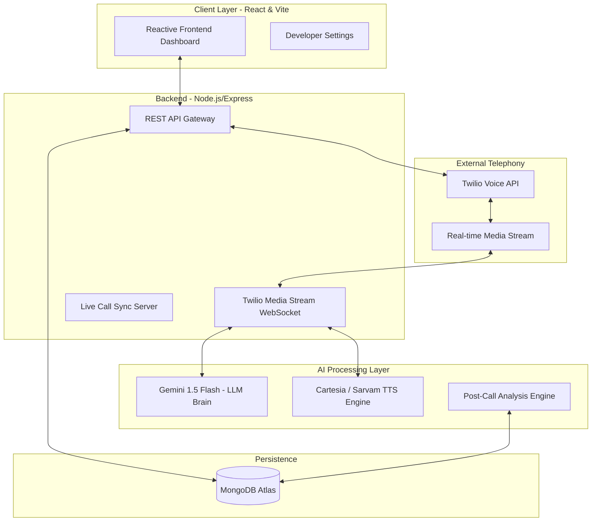

# Voicely: Open-Source AI Voice Orchestration & Campaign Manager

**Voicely** is a modern, enterprise-grade, **open-source** platform designed for automated Speech-to-Speech (S2S) interactions, intelligent lead tracking, and outbound campaign management. 

By integrating high-performance LLMs (Gemini) with real-time telephony (Twilio) and ultra-low latency TTS (Cartesia/Sarvam), Voicely enables developers and businesses to self-host and automate incredibly natural AI-driven phone calls.

---

#### The Open Source Mission

Our goal is to make **Voicely** the go-to, community-driven, self-hostable platform for **Speech-to-Speech (S2S)** voice agents. We believe that powerful AI voice orchestration shouldn't be locked behind expensive, proprietary enterprise SaaS platforms. 

- **100% Open Source & Self-Hostable:** No vendor lock-in. No hidden subscription fees. Deploy it on your own AWS, DigitalOcean, or Vercel/Render infrastructure.
- **BYOK (Bring Your Own Keys):** Connect your own Twilio, Cartesia, and LLM API keys directly in the Settings dashboard. You control your usage and costs.
- **Community-Driven:** Built by developers, for developers. Easily fork the repo to integrate new open-weight AI models, local LLMs, or alternative TTS providers.

---

## Core Features

- **Autonomous Campaign Manager:** Upload a CSV of contacts (Name, Phone Number) and instantly orchestrate bulk outbound AI calls.
- **Voice Agent Builder:** Create custom AI personas (Modules) with tailored system prompts, dynamic questions, and specific language/voice selections.
- **Ultra-Low Latency S2S:** Utilizes WebSockets for real-time bidirectional media streaming, achieving natural, human-like conversation speeds.
- **Multi-Provider Support:**
  - **Telephony:** Twilio Voice & Media Streams.
  - **TTS (Text-to-Speech):** Cartesia (English) & Sarvam AI (Hindi/Regional).
  - **LLM (The Brain):** Gemini 1.5 Flash (Optimized for speed), Groq, OpenAI.
- **Analytics Dashboard:** Real-time call logs, duration tracking, success rates, and post-call semantic outcome analysis.
- **Developer API:** Generate secure API keys from the Developer dashboard and trigger calls programmatically.
- **Premium Minimal UI:** A beautifully designed, dark-themed, highly responsive dashboard built with React, Vite, and Tailwind CSS.

---

## API Documentation

Want to integrate Voicely into your own CRM or application? We provide a comprehensive REST API to manage agents, initiate calls, and fetch analytics programmatically.

**[Read the Full API Documentation here](./API.md)**

---

## Architecture & High-Level Design (HLD)

Voicely uses a robust **Monolith** architecture (Node.js/Express backend + React frontend). We specifically chose a monolith approach to make it incredibly easy for the open-source community to deploy, understand, and contribute to, without the headache of managing multiple microservices. 

Despite being a monolith, it scales horizontally perfectly behind a load balancer since the REST API is completely stateless, and WebSocket connections can be load-balanced easily.

### Component Interaction Diagram



---

## Technical Stack

- **Frontend:** React 18, Vite, TypeScript, Tailwind CSS, Lucide Icons.
- **Backend:** Node.js, Express, WebSockets (`ws`), Mongoose.
- **Database:** MongoDB (Atlas or Local).
- **Voice & Telephony:** Twilio Voice API, Twilio Media Streams.

---

## Installation & Self-Hosting

### Prerequisites
- Node.js (v18+)
- MongoDB instance (Atlas recommended)
- Twilio Account (with a verified phone number)
- Gemini API Key (for LLM)
- Cartesia API Key (for Text-to-Speech)

### 1. Clone the Repository
```bash
git clone https://github.com/YourUsername/Voicely.git
cd Voicely
```

### 2. Backend Setup
Create a `.env` file in the `backend` directory:
```bash
PORT=5001
NODE_ENV=development
JWT_SECRET=your_super_secret_jwt_key
MONGODB_URI=your_mongodb_connection_string
```
*(Note: Provider API keys like Twilio and Cartesia are configured securely inside the Voicely UI via the Settings tab, stored encrypted in your database!)*

Install dependencies and run:
```bash
cd backend
npm install
npm run dev
```

### 3. Frontend Setup
Create a `.env` file in the `frontend` directory:
```bash
VITE_API_URL=http://localhost:5001/api
```

Install dependencies and run:
```bash
cd frontend
npm install
npm run dev
```

### 4. Twilio Tunneling (Local Development)
To receive live calls locally, you must expose your local WebSocket server to the internet using a tool like `ngrok`:
```bash
ngrok http 5001
```
Then, update your Twilio Webhook URL in the Twilio Console to point to your ngrok address (e.g., `https://your-ngrok-url.ngrok.io/api/calls/twiml`).

---

## Contributing

We welcome contributions from the community! Whether it's fixing bugs, improving the UI, or adding new LLM/TTS adapters.

1. Fork the repository.
2. Create a new branch (`git checkout -b feature/your-feature-name`).
3. Commit your changes (`git commit -m 'Add awesome feature'`).
4. Push to the branch (`git push origin feature/your-feature-name`).
5. Open a Pull Request.

Please check the **Issues** tab for beginner-friendly tasks!

---

## License

This project is open-source and licensed under the **MIT License**. You are completely free to use, self-host, modify, and distribute this software for personal and commercial use without fees. 
