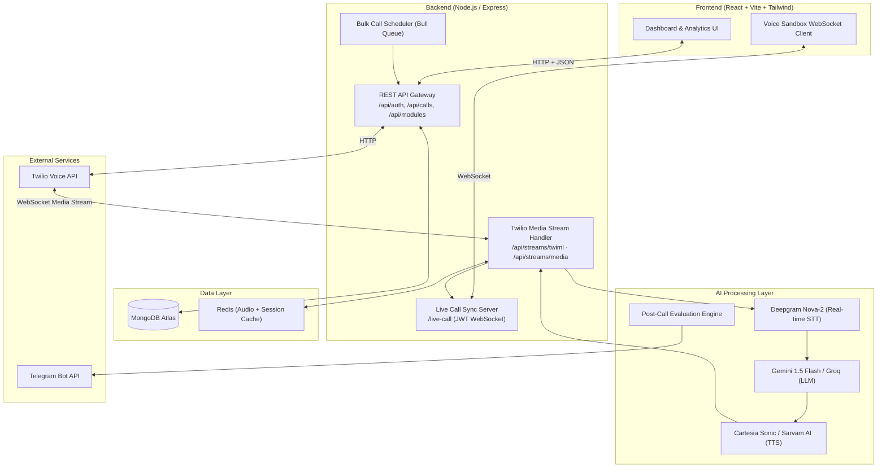

<div align="center">

<br />


<br />
<br />

# Voicely

**The open-source, ultra-low latency Speech-to-Speech AI voice agent platform.**  
Build, deploy, and orchestrate AI phone agents in minutes — not months.

<br />

[](./LICENSE)
[](./CONTRIBUTING.md)
[](https://nodejs.org)
[](https://reactjs.org)
[](https://typescriptlang.org)
[](https://mongodb.com)

<br />

[Live Demo](https://voicely.vercel.app) · [API Docs](./API.md) · [Report Bug](https://github.com/AbhigyanRaj/Voicely/issues) · [Request Feature](https://github.com/AbhigyanRaj/Voicely/issues)

</div>

---

## What is Voicely?

Voicely is a **100% open-source**, self-hostable platform for building production-grade AI voice agents. It connects real-time telephony (Twilio), state-of-the-art LLMs (Gemini, Groq), and ultra-low latency TTS (Cartesia, Sarvam AI) into a single, seamless platform — with a beautiful dashboard, an analytics engine, and a full developer API.

We built Voicely because powerful voice AI shouldn't be locked behind $10,000/month enterprise contracts. Fork it, self-host it, extend it.

```
Incoming Call → Twilio Media Streams → Deepgram STT → Gemini/Groq LLM → Cartesia/Sarvam TTS → Caller
                                                  ↕
                                        Live Dashboard Sync (WebSocket)
```

---

## Core Features

| Feature | Description |
|---|---|
| **Voice Agent Builder** | Create custom AI personas with system prompts, dynamic Q&A scripts, and per-agent voice/language selection. |
| **Outbound Campaign Manager** | Upload a CSV of contacts and run fully automated bulk outbound AI call campaigns. |
| **Ultra-Low Latency S2S** | Real-time bidirectional audio streaming over WebSockets for natural, sub-second conversational AI. |
| **Analytics & Evaluation Engine** | Post-call semantic analysis — sentiment, intent tier, objection tracking, and AI-scored lead qualification. |
| **Voice Sandbox** | Test any agent live in your browser before deploying to real phone calls — no phone number required. |
| **Developer API** | Generate API keys and trigger calls, manage agents, and query analytics programmatically. |
| **Telegram Intel Bridge** | Receive live call summaries and AI evaluation results directly in your Telegram. |
| **BYOK (Bring Your Own Keys)** | Connect your own Twilio, Cartesia, Gemini, and Deepgram keys from the Settings UI. Zero vendor lock-in. |
| **Multi-Language Support** | English, Hindi, and regional Indian languages via Cartesia and Sarvam AI voice engines. |

---

## Architecture

Voicely uses a deliberately simple **monolithic architecture** — a single Node.js/Express backend and a React SPA frontend. This makes it trivial to understand, fork, and self-host.

The REST API is completely stateless (all session data in MongoDB), so horizontal scaling behind a load balancer works out of the box.



### Call Flow (Step-by-Step)

1. **Outbound Trigger:** A campaign or API call hits `/api/calls/initiate`, which calls the Twilio REST API to dial the customer.
2. **Media Stream Established:** Twilio calls back to `/api/streams/twiml`, which returns TwiML instructing Twilio to open a WebSocket to `/api/streams/media`.
3. **Real-Time STT:** Incoming audio chunks (G.711 μ-Law) stream to Deepgram Nova-2 over a persistent WebSocket connection.
4. **LLM Response:** Deepgram final transcripts are dispatched to Gemini 1.5 Flash (or Groq) with the agent's system prompt and conversation history.
5. **TTS Synthesis:** The LLM response is streamed to Cartesia (or Sarvam AI) and the synthesized audio is immediately piped back through Twilio — achieving barge-in-capable, fully duplex conversation.
6. **Live Dashboard Sync:** The `/live-call` WebSocket server broadcasts real-time transcripts and events to any connected dashboard session.
7. **Post-Call Evaluation:** On call completion, a final evaluation prompt is sent to Gemini to analyze the conversation — generating intent tier, sentiment, and a structured lead qualification result.

---

## Tech Stack

### Backend
| Layer | Technology |
|---|---|
| Runtime | Node.js 18+, ES Modules |
| Framework | Express.js |
| WebSockets | `ws` library (Twilio Media + Live Dashboard) |
| Database ORM | Mongoose 8 |
| Authentication | JWT (RS256), Google OAuth 2.0 |
| Logging | Pino (structured JSON logging) |
| Security | Helmet, express-rate-limit |
| Validation | Zod |

### Frontend
| Layer | Technology |
|---|---|
| Framework | React 18, TypeScript |
| Build Tool | Vite 7 |
| Styling | Tailwind CSS v4 |
| Data Fetching | TanStack Query (React Query) v5 |
| Routing | React Router v7 |
| Auth | `@react-oauth/google` |

### AI / Voice Providers
| Provider | Role |
|---|---|
| **Deepgram Nova-2** | Real-time Speech-to-Text (STT) |
| **Google Gemini 1.5 Flash** | Primary LLM (reasoning + evaluation) |
| **Groq (Llama 3)** | Alternative low-latency LLM |
| **Cartesia Sonic** | Ultra-low latency TTS (English) |
| **Sarvam AI** | Regional language TTS (Hindi + Indian languages) |
| **Google Cloud TTS** | Fallback TTS provider |
| **Twilio Voice** | Telephony backbone (PSTN calls + Media Streams) |

---

## Self-Hosting Guide

### Prerequisites

- **Node.js** v18 or higher
- **MongoDB** instance (MongoDB Atlas M0 Free is sufficient to start)
- **Twilio Account** with a phone number and Media Streams enabled
- **Deepgram API Key** (for real-time STT)
- **Gemini API Key** (`gemini-1.5-flash`)
- **Cartesia API Key** (for English TTS)

---

### 1. Clone the Repository

```bash
git clone https://github.com/AbhigyanRaj/Voicely.git
cd Voicely
```

---

### 2. Backend Setup

Create `backend/.env` from the example:

```bash
cp backend/.env.example backend/.env
```

Then populate your values:

```env
# Core
PORT=5001
NODE_ENV=development
JWT_SECRET=your_super_secret_jwt_key_minimum_32_chars

# Database
MONGODB_URI=mongodb+srv://<user>:<password>@cluster.mongodb.net/voicely

# Google OAuth (for dashboard login)
GOOGLE_CLIENT_ID=your_google_oauth_client_id

# Optional: Redis (for audio caching - falls back to in-memory if not set)
REDIS_URL=redis://localhost:6379
```

> **Note:** Twilio, Cartesia, Deepgram, and Gemini API keys are configured **per-workspace** directly from the Voicely Settings UI and stored encrypted in MongoDB. You do **not** need to hardcode them in `.env`.

Install dependencies and start the dev server:

```bash
cd backend
npm install
npm run dev
```

The API server will start on `http://localhost:5001`.

---

### 3. Frontend Setup

Create `frontend/.env`:

```env
VITE_API_URL=http://localhost:5001/api
VITE_WS_URL=ws://localhost:5001
VITE_GOOGLE_CLIENT_ID=your_google_oauth_client_id
```

Install dependencies and start:

```bash
cd frontend
npm install
npm run dev
```

The dashboard will be available at `http://localhost:5173`.

---

### 4. Twilio Webhook Configuration (Local Development)

Live phone calls require Twilio to reach your local backend. Use [ngrok](https://ngrok.com) or [Cloudflare Tunnel](https://developers.cloudflare.com/cloudflare-one/connections/connect-networks/) to expose port 5001:

```bash
ngrok http 5001
```

In your [Twilio Console](https://console.twilio.com), update your phone number's voice webhook to:

```
https://<your-ngrok-id>.ngrok.io/api/calls/twiml
```

For the Voice Sandbox (browser-based), also update the browser stream URL to:
```
https://<your-ngrok-id>.ngrok.io/api/streams/twiml
```

---

### 5. Verify the Setup

Once both servers are running, navigate to `http://localhost:5173`:

1. Sign in with Google or create an email account.
2. Go to **Settings** → add your Twilio, Gemini, Cartesia, and Deepgram credentials.
3. Go to **My Agents** → create your first voice module.
4. Try the **Voice Sandbox** to test your agent live in the browser.
5. Go to **Campaigns** → upload a CSV and launch an outbound campaign.

---

## Project Structure

```
Voicely/
├── backend/
│   └── src/
│       ├── controllers/         # Route handlers (auth, calls, modules, analytics)
│       ├── middleware/          # JWT auth, rate limiting, request validation
│       ├── models/              # Mongoose schemas (User, Call, Module, Lead, ...)
│       ├── routes/              # Express route definitions
│       ├── services/            # Core business logic
│       │   ├── streamingCallHandler.js   # Main real-time S2S pipeline
│       │   ├── hybridTTS.js              # Multi-provider TTS orchestrator
│       │   ├── cartesiaService.js        # Cartesia Sonic integration
│       │   ├── sarvamService.js          # Sarvam AI integration
│       │   ├── deepgramService.js        # Deepgram STT integration
│       │   └── schedulerService.js       # Bulk campaign queue
│       ├── utils/               # Logger, cache, DB utils, env validator
│       ├── validators/          # Zod validation schemas
│       └── websocket/
│           └── liveCallServer.js         # JWT-secured live transcript WebSocket
│
├── frontend/
│   └── src/
│       ├── components/          # All React UI components
│       │   ├── AnalyticsPage.tsx         # Full analytics dashboard
│       │   ├── CreateModule.tsx          # Voice agent builder wizard
│       │   ├── VoiceSandbox.tsx          # In-browser live test interface
│       │   └── LiveCallModal.tsx         # Real-time call monitor
│       ├── contexts/            # React contexts (AuthContext)
│       ├── lib/                 # API helpers, auth, TTS config, queryClient
│       └── pages/               # Page-level route components
│
├── API.md                       # Full REST API documentation
├── CONTRIBUTING.md              # Contribution guidelines
├── render.yaml                  # Render.com deployment config
└── vercel.json                  # Vercel deployment config
```

---

## Deployment

### Deploy to Render + Vercel (Recommended for Free Tier)

**Backend → Render:**

```yaml
# render.yaml (already included in repo)
services:
  - type: web
    name: voicely-backend
    env: node
    buildCommand: cd backend && npm install
    startCommand: cd backend && npm start
```

Push to GitHub and connect your repo in the [Render Dashboard](https://render.com). Add your environment variables in the Render service settings.

**Frontend → Vercel:**

```bash
cd frontend
npx vercel --prod
```

Set `VITE_API_URL` to your Render backend URL in the Vercel project settings.

---

### Enterprise Scaling (AWS)

For production workloads, the monolithic architecture scales horizontally behind an Application Load Balancer with sticky sessions for WebSockets.

| Component | Technology | Projected Capacity |
|---|---|---|
| API + Dashboard | AWS ECS / Fargate (auto-scaling) | 100,000+ concurrent users |
| WebSocket (Live Calls) | ALB with sticky sessions | 5,000–20,000+ concurrent streams |
| Database | MongoDB Atlas M40+ (dedicated) | Unlimited (sharded) |
| Cache | AWS ElastiCache (Redis) | Sub-millisecond audio cache |

---

## REST API

Voicely exposes a full REST API for programmatic control. Generate an API key from the **Developer** tab in the dashboard.

```bash
# Trigger an outbound AI call
curl -X POST https://your-voicely-instance.com/api/calls/initiate \
  -H "Authorization: Bearer YOUR_API_KEY" \
  -H "Content-Type: application/json" \
  -d '{
    "moduleId": "your_module_id",
    "customerName": "Priya Sharma",
    "phoneNumber": "+919876543210"
  }'
```

**→ [Full API Reference](./API.md)**

---

## Contributing

Contributions are what make open source great. All contributions are welcome — from bug fixes and docs to new TTS adapters or LLM integrations.

### Getting Started

1. **Fork** the repository.
2. **Create a branch:** `git checkout -b feat/your-feature-name`
3. **Make your changes** and write clear, descriptive commits.
4. **Push** your branch: `git push origin feat/your-feature-name`
5. **Open a Pull Request** — describe what you changed and why.

### Good First Issues

Check the [Issues](https://github.com/AbhigyanRaj/Voicely/issues) tab for issues labeled `good first issue`. These are the best place to start.

### Areas We'd Love Help With

- **New TTS Adapters** — ElevenLabs, OpenAI TTS, Azure Cognitive Services
- **New LLM Adapters** — Claude, Mistral, local Ollama models
- **Internationalization** — More regional language support
- **Mobile Dashboard** — React Native companion app
- **Test Coverage** — Unit and integration tests for the call pipeline

**→ [Read CONTRIBUTING.md](./CONTRIBUTING.md)**

---

## License

Distributed under the **MIT License**. You are free to use, modify, distribute, and self-host Voicely — for personal or commercial projects — without any fees or restrictions.

See [LICENSE](./LICENSE) for the full text.

---

<div align="center">

**Built by the Voicely Community**

<br />

**Star this repo** if Voicely helps you ship faster — it helps more developers find the project.

<br />

[](https://github.com/AbhigyanRaj/Voicely)

</div>
