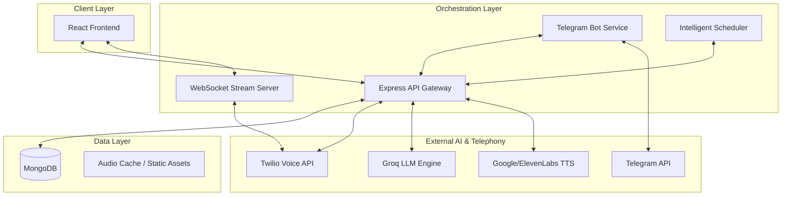

# Voicely.AI: Professional AI Voice Orchestration and Lead Management

Voicely.AI is a sophisticated, enterprise-grade platform designed for automated voice interactions and intelligent lead journey tracking. By integrating high-performance LLMs with real-time telephony, Voicely.AI enables businesses to automate customer engagement, qualify leads through AI analysis, and manage lifecycle transitions with precision.

---

## High-Level Design (HDL)

The Voicely.AI architecture is built on a decoupled micro-service model, ensuring scalability and low-latency processing for real-time voice streams. The system orchestrates interactions between a reactive frontend, a transactional backend, and a suite of third-party AI and communication services.

### System Architecture Diagram



### Core Components

#### 1. API Orchestration Layer
The backend, built on Node.js and Express, serves as the central nervous system. It handles authentication, lead management, workspace isolation, and call routing. It enforces strict environment validation and manages the initialization of all dependent services.

#### 2. Real-Time Media Streaming
Utilizing WebSockets, the system establishes bidirectional media streams with Twilio. This allows for near-instantaneous transcription and response generation, enabling natural-sounding conversations between the AI agent and the customer.

#### 3. AI Evaluation Engine
Voicely.AI leverages the Groq LLM engine to perform deep analysis of call transcripts. Post-call, the engine evaluates customer intent, extracts key information, and assigns semantic labels (e.g., "Warm Lead", "Positive Interest") to the lead's journey.

#### 4. Lead Journey Tracking
A proprietary tracking system that models the lifecycle of a lead through a strict, 4-stage progression:
- **Initiated**: The trigger event for engagement.
- **Picked Up**: Verification of successful connection.
- **Outcome (Semantic Label)**: AI-driven qualification results.
- **Completed**: Final state of the interaction including duration and summary.

---

## Technical Stack

- **Frontend**: React 18, Vite, TypeScript, Tailwind CSS, Mermaid.js (for visualization).
- **Backend**: Node.js, Express, WebSocket (ws), Mongoose.
- **Database**: MongoDB (Atlas/Local).
- **Voice Stack**: Twilio Voice, Media Streams.
- **AI Core**: Groq SDK (Llama 3/70B models), Google Cloud TTS, ElevenLabs.
- **Messaging**: Telegram Bot API.

---

## Core Features

- **Autonomous Call Orchestration**: Programmatic initiation and management of outbound/inbound calls via Twilio.
- **Intelligent Transcription**: Real-time conversion of audio streams to text for instant processing.
- **Semantic Lead Analysis**: Post-call evaluation that transforms raw data into actionable business intelligence.
- **Telegram Command Center**: A fully integrated bot that provides status updates and allows for remote call management.
- **Strict Lifecycle Journey**: A high-reliability visualization tool for tracking lead progress across multiple touchpoints.
- **Shared Audio Library**: Cached TTS assets to reduce latency and API consumption.

---

## Installation and Setup

### Prerequisites
- Node.js (version 18.x or higher)
- MongoDB (running instance)
- Twilio Account (with a verified number)
- Groq API Key
- Telegram Bot Token

### Environment Configuration
Create a `.env` file in the `backend` directory with the following parameters:

```bash
# Server Configuration
PORT=5001
NODE_ENV=development
JWT_SECRET=your_secret_key

# Database
MONGODB_URI=your_mongodb_connection_string

# Twilio
TWILIO_ACCOUNT_SID=your_sid
TWILIO_AUTH_TOKEN=your_token
TWILIO_PHONE_NUMBER=your_number

# AI Services
GROQ_API_KEY=your_groq_key
GOOGLE_APPLICATION_CREDENTIALS=path_to_json (Optional)
ELEVENLABS_API_KEY=your_key (Optional)

# Telegram
TELEGRAM_BOT_TOKEN=your_bot_token
```

### Deployment Steps

1. **Clone the Repository**
2. **Backend Setup**:
   ```bash
   cd backend
   npm install
   npm run dev
   ```
3. **Frontend Setup**:
   ```bash
   cd frontend
   npm install
   npm run dev
   ```
4. **Tunneling (Required for Twilio Webhooks)**:
   ```bash
   ngrok http 5001
   ```
   Update the Twilio console and project environment with the ngrok URL.

---

## Strategic High-Level Design (HDL) Philosophy

Voicely.AI is designed with a "Fail-Fast and Notify" philosophy. All critical stages of the call lifecycle are monitored for failure (e.g., Busy, No Answer). When a failure occurs, the system preserves the state, updates the Lead Journey with a failure status (represented visually in yellow), and triggers an immediate notification via the Telegram Command Center. This ensures that no lead is lost due to technical or connection issues.

The data model enforces strict relational integrity between Workspace, Lead, and Call entities, allowing for complex multi-tenant operations while maintaining absolute data isolation.
